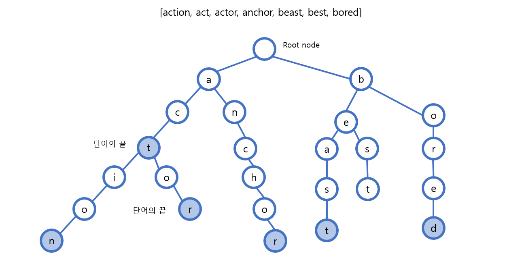
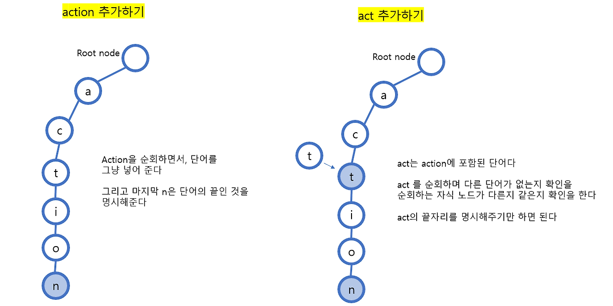
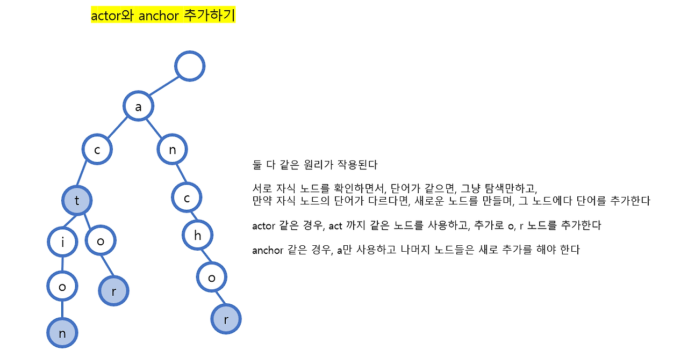
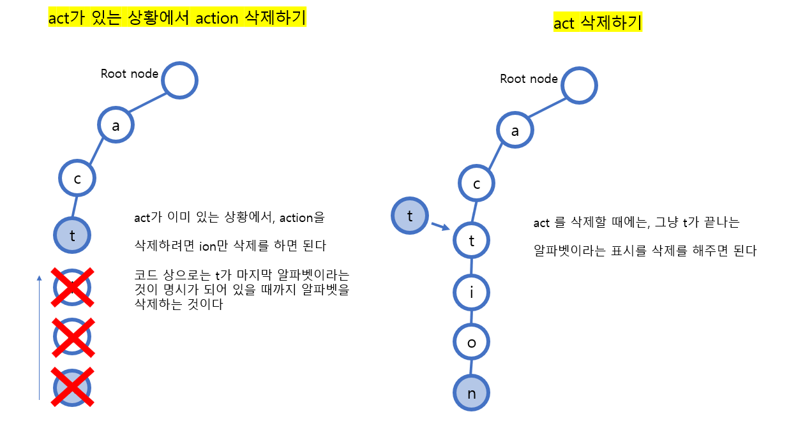

# 트라이 자료구조

- 트리 형태의 자료구조
- 문자열을 저장, 삭제, 탐색을 빠르게 하기 위해서 만들어졌다

그림으로 이해하는 게 빠르다:



## 추가

### a단어가 트리에 아에 없거나, 단어가 다른 하나의 단어에 포함되어 있을 때



### 부분적으로 같은 알파벳을 두 단어가 갖고 있을 때



## 삭제



## 활용분야

1. 자동완성2. 정렬
2. 전문검색

## 코드

```java
static class Node{
	// 노드의 자식 노드들을 저장
	HashMap<Character, Node> child;
	// 이 노드가 단어의 끝인지 저장
	boolean endOfWord;
	public Node() {
		this.child = new HashMap<>();
		this.endOfWord = false;
	}
}
static class Trie{
	Node root;

	public Trie() {
		this.root = new Node();
	}
	/**
	 * 맨 처음에 node = this.root -> 루트 노드부터 시작한다.
	 * for문을 돌면서, 한 문자씩 각 노드의 child 노드에 값이 있나 확인하고
	 * 있으면 해당 노드로 이동/ 없다면 이번 문자 노드를 생성 & 그 노드로 이동
	 *
	 * for문이 종료되면 node에는 마지막 문자에 해당하는 노드가 저장되어 있을테니
	 * 해당 노드의 endOfWord를 true로 바꿔준다.
	 * @param str
	 */
	public void insert(String str) {
		// 시작 노드를 루트노드로 설정 (루트노드에는 값이 없다)
		Node node = this.root;
		for(int i=0; i<str.length(); i++) {
			char c = str.charAt(i);

			// 문자열의 각 단어를 가져와서, 자식 노드 중에 있는지 체크한다.
			// 있을 때: node = node.child.get(str.charAt(i)); (putIfAbsent는 값 존재시, value 반환)
			// 없을 때: 새로운 노드를 생성해서 넣는다.
			node.child.putIfAbsent(c, new Node());

			node = node.child.get(c); // 자식 노드로 이동
		}
		// for문이 끝나면 현재 노드는 마지막 글자 -> 단어의 끝임을 명시
		node.endOfWord = true;
	}
	/**
	 * 삽입 함수처럼, 자식 노드들 중 원하는 문자가 있는지 확인한다.
	 * 중간에 하나라도 없으면 탐색 실패이다.
	 * 마지막 문자까지 찾으면,
	 * 	마지막으로 endOfWord가 true인지 확인한다.
	 * @param str
	 * @return
	 */
	public boolean search(String str) {
		Node cur = this.root;

		for(int i=0; i<str.length(); i++) {
			char c = str.charAt(i);

			if(!cur.child.containsKey(c)) { // 자식 노드에 c가 있으면 계속 탐색을 진행하고,
				return false;
			}

			cur = cur.child.get(c);

			// 마지막 문자열에 도달했을 때,
			// 해당 알파벳에 마지막 알파벳이라는 표시가 없으면 해당 단어는 존재하지 않는 것이다.
			if(i == str.length()-1) {
				if(!cur.endOfWord) return false;
			}
		}
		return true;
	}

	/**
	 * 삭제 메서드는 사용자가 삭제 요청 시 사용하는 public boolean delete(String str); 메서드,
	 * 내부에서 재귀를 통해 삭제하는private boolean delete(Node node, String str, int idx) 메서드로 나뉜다.
	 *
	 * 위의 메서드에서 아래 메서드를 한번 호출해주고 아래 메서드에서 재귀적으로 노드들을 찾는다.
	 * @param str
	 * @return
	 */
	public boolean delete(String str) {
		boolean result = delete(this.root, str, 0);
		return result;
	}
	public boolean delete(Node node, String str, int idx){
		char c = str.charAt(idx);

		// 현재 노드의 자식 노드에서 c를 지워야 하는데
		// 없으면 return false
		if(!node.child.containsKey(c)) return false;

		// 있으면 계속 찾아 내려가야 한다.
		Node cur = node.child.get(c);
		idx++;

		// 1. 문자열의 끝에 도달했을 때: 삭제할 단어의 마지막 문자 노드를 처리하는 부분
		if(idx == str.length()) { // 문자열의 끝에 도달하면
			if(!cur.endOfWord) return false; // 근데 삭제하려던 그 문자가 아니면 -> 삭제가 불가능한 것이니 false 리턴

			// endOfWord가 true이면 삭제하려면 그 문자가 맞는 거니까, false로 바꾸면 더 이상 그 문자는 존재하는 것이 아니게 된다.
			cur.endOfWord = false;  // 논리적으로 삭제하는 것.

			// 현재 노드에서, 자식 노드가 비었는지 확인
            // 안 비어있다면, 그냥 마지막 알파벳을 false 처리하고, 끝내면 된다
			if(cur.child.isEmpty()) {
				node.child.remove(c); // node는 cur노드의 부모 노드; cur을 삭제
			}
		}else { // 2. 문자열의 끝에 도달하지 않았을 때: 다음 문자로 계속 파고드는 부분
			// 재귀적으로 현재 노드부터 다시 호출한다.
			if(!this.delete(cur,str,idx)) { // 삭제에 실패한 경우
				return false;
			}

			// true를 반환받았고, 자식노드가 비어있으면 현재 노드를 삭제한다.
			// "node"는 "cur"의 부모노드임. 즉, "cur"노드를 "node"의 자식 Map에서 삭제하자.
			if(!cur.endOfWord && cur.child.isEmpty()) {
				node.child.remove(c);
			}
		}
		return true;
	}
}
```
